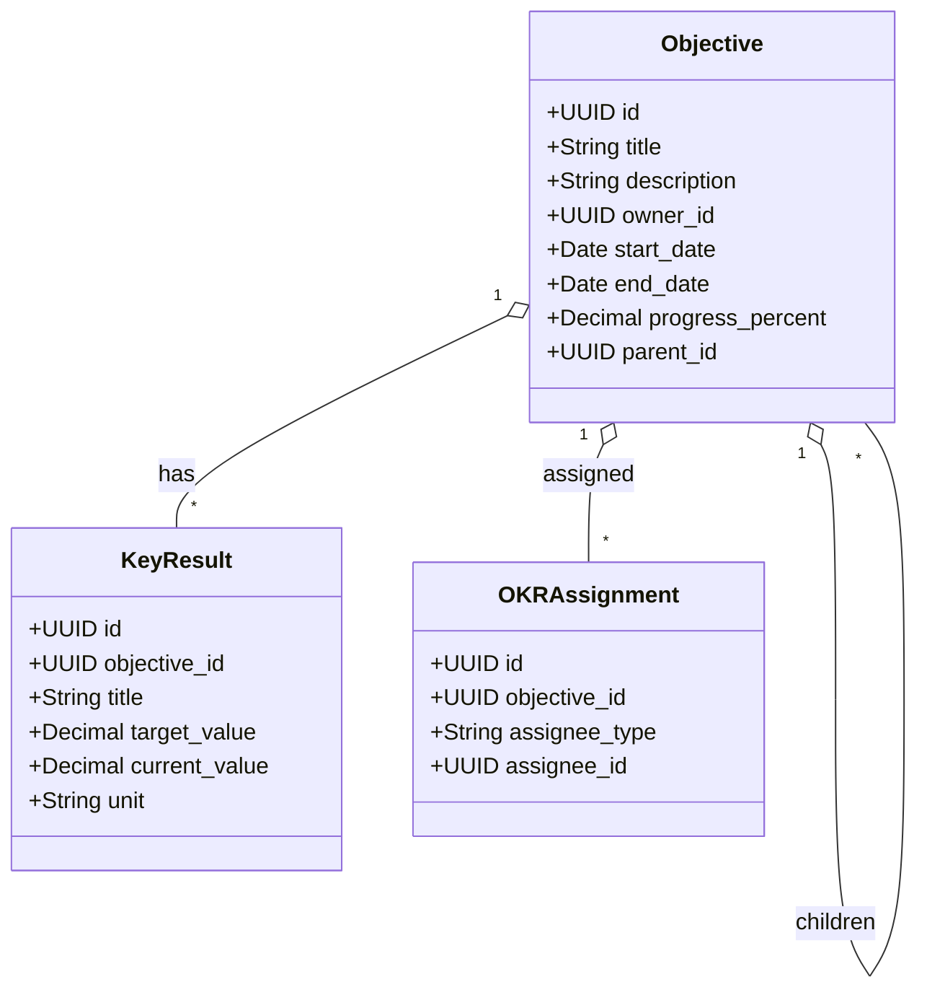
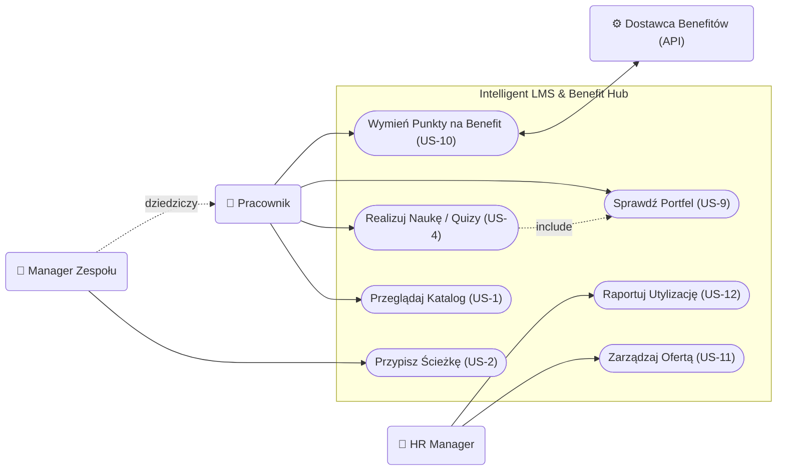

# Specyfikacja Wymagań Oprogramowania (SRS)

**Tytuł Projektu:** Intelligent LMS
**Wersja:** 0.1.1
**Zespół:** Zespół Projektowy ZPI

---

## 1. Wstęp

### 1.1. Cel
Celem niniejszego dokumentu jest zdefiniowanie wymagań funkcjonalnych i niefunkcjonalnych dla systemu "Intelligent LMS". Dokument ten służy jako podstawa do prac projektowych, implementacyjnych oraz testowych. Jest przeznaczony dla zespołu deweloperskiego, kierowników projektu oraz interesariuszy biznesowych (CTO, HR).

### 1.2. Wizja, Zakres i Cele Produktu
**Wizja:**
Stworzenie inteligentnej platformy rozwojowo-benefitowej LMS (Learning Management System), która przekształca organizację w środowisko ciągłego uczenia się ("Learning Organization"), gdzie każdy pracownik ma dostęp do spersonalizowanej ścieżki rozwoju (Learning Path) bezpośrednio powiązanej z celami biznesowymi firmy oraz elastycznym systemem nagród.
Każda ścieżka rozwoju będzie bezpośrednio powiązana z celami firmy poprzez mechanizm OKR (Objectives and Key Results). System umożliwi kaskadowanie celów od poziomu strategicznego do celów indywidualnych, wizualizację drzewa celów oraz kwartalną weryfikację realizacji strategii.

**Zakres:**
System będzie umożliwiał zarządzanie ścieżkami rozwoju, przydzielanie kursów, weryfikację wiedzy poprzez quizy, raportowanie postępów oraz obsługę wirtualnego portfela punktowego. Kluczowym elementem jest platforma kafeteryjna, zintegrowana z dostawcami usług zewnętrznych, umożliwiająca wymianę punktów na benefity rozwojowe i prozdrowotne.

System będzie również wspierał definiowanie, kaskadowanie i monitorowanie celów OKR, wymuszając hierarchiczną strukturę danych, zapewniając mechanizmy wizualizacji drzewa celów oraz analitykę postępów powiązaną z celami biznesowymi.

**Kryteria Akceptacji (KPIs):**
*   **Upskilling:** Przeszkolenie 60% kadry technicznej z nowych technologii w ciągu 12 miesięcy.
*   **Oszczędność:** Redukcja wydatków na zewnętrznych konsultantów o 200 tys. PLN rocznie.
*   **Zaangażowanie:** Wskaźnik ukończenia kursów na poziomie > 85%.
*   **Optymalizacja Budżetu:** zwiększenie utylizacji budżetu szkoleniowo-benefitowego do 95% (z obecnych 60%) w ciągu 12 miesięcy poprzez wdrożenie platformy kafeteryjnej.

**Cele Biznesowe (OKR):**
*   **Zarządzanie przez cele (OKR):** Zapewnienie 100% transparentności powiązań między celami indywidualnymi a strategią firmy w ciągu 3 miesięcy, poprzez system kaskadowania celów OKR, co pozwoli na kwartalną weryfikację realizacji strategii. (Wymusza hierarchiczną strukturę danych, wizualizację drzewa celów i analitykę postępów.)

**Poza Zakresem:**
System nie będzie obsługiwał płatności za kursy (wszystkie materiały są wewnętrzne lub opłacone ryczałtem) ani rekrutacji nowych pracowników.

### 1.3. Definicje, Akronimy i Skróty
*   **LMS (Learning Management System):** System zarządzania nauczaniem.
*   **Learning Path:** Zorganizowana sekwencja kursów i materiałów mająca na celu rozwój konkretnych kompetencji.
*   **Active Recall:** Metoda nauki polegająca na aktywnym przywoływaniu informacji (np. odpowiadanie na pytania w trakcie wideo).
*   **Spaced Repetition:** Metoda nauki oparta na powtórkach rozłożonych w czasie.
*   **KPI (Key Performance Indicator):** Kluczowy wskaźnik efektywności.
*   **System Kafeteryjny:** Model benefitów pozwalający pracownikowi na samodzielny wybór świadczeń z udostępnionej puli usług.
*   **Portfel Wirtualny:** Moduł zarządzający saldem punktów pracownika, zdobytych za aktywność edukacyjną.

### 1.4. Przegląd Dokumentu
Dokument składa się z 7 rozdziałów. Po wstępie (Rozdział 1), Rozdział 2 przedstawia ogólny opis systemu, w tym charakterystykę użytkowników. Rozdział 3 definiuje wymagania interfejsów. Kluczowy Rozdział 4 szczegółowo opisuje wymagania funkcjonalne w formacie User Stories. Rozdział 5 to wymagania niefunkcjonalne. Rozdział 6 zawiera analizę porównawczą, a Rozdział 7 dodatki, w tym diagramy.

---

## 2. Opis Ogólny

### 2.1. Główne Funkcje Produktu
System Intelligent LMS składa się z następujących głównych modułów funkcjonalnych:

*   **Zarządzanie Ścieżkami Rozwoju (Learning Paths):** Tworzenie i edycja ścieżek edukacyjnych.
*   **Katalog Kursów:** Przeglądanie i wyszukiwanie dostępnych szkoleń.
*   **Moduł Odtwarzania (Player):** Odtwarzanie wideo, w tym wideo interaktywnego (Active Recall).
*   **Weryfikacja Wiedzy:** Moduł quizów i testów sprawdzających.
*   **Inteligentny Asystent Powtórek:** System Spaced Repetition sugerujący powtórki.
*   **Raportowanie i Analityka:** Generowanie raportów dla managerów i HR.
*   **Wirtualny Portfel i Silnik Kafeteryjny:** Moduł transakcyjny zarządzający punktami. Odpowiada za przeliczanie postępów w nauce na jednostki płatnicze i ich wymianę wewnątrz Marketplace.
*   **Zaawansowana Analityka Budżetowa:** Monitorowanie wskaźników utylizacji budżetu (KPI: 95%) oraz efektywności kosztowej programów rozwojowych.
*   **Moduł Integracji Zewnętrznych:** Automatyczna komunikacja z dostawcami usług (np. generowanie voucherów w systemach partnerów).

### 2.2. Klasy Użytkowników

**Rola:** HR Manager / Administrator
*   **Opis:** Zarządza budżetem, użytkownikami, ścieżkami szkoleniowymi i ofertą świadczonych usług. Monitoruje postępy.
*   **Persona:** **Anna (35 lat)**. Cel: Chce efektywnie zarządzać budżetem szkoleniowym. Chce widzieć pełny obraz zwrotu z inwestycji (ROI) oraz zautomatyzować proces wydawania benefitów, by uniknąć pracy w arkuszach kalkulacyjnych. Frustracja: Brak weryfikacji efektów szkoleń. Traci 5 godzin tygodniowo na przepisywanie punktów z systemu szkoleń do arkusza zamówień benefitów.

**Rola:** Pracownik / Developer
*   **Opis:** Korzysta z systemu do nauki, realizuje przypisane ścieżki.
*   **Persona:** **Piotr (29 lat)**. Senior Developer. Cel: Chce pogłębiać wiedzę techniczną bez tracenia czasu na szukanie materiałów. Chce rozwijać kompetencje techniczne i mieć realny wpływ na wybór swoich benefitów (wellness/rozwój) w ramach zdobytych punktów. Frustracja: Niespójne źródła wiedzy. Dostał kolejną kartę sportową, z której nie korzysta, a wolałby dofinansowanie do ergonomicznego fotela lub sesję z trenerem kręgosłupa.

**Rola:** Manager Zespołu
*   **Opis:** Przypisuje ścieżki podwładnym i monitoruje ich rozwój w kontekście potrzeb projektowych. Monitoruje rozwój i wellbeing podwładnych.

### 2.3. Ograniczenia Projektowe i Implementacyjne
**Technologiczne:**
*   **Ograniczenie budżetowe (Infrastruktura):**
    *   **Treść:** Miesięczny koszt utrzymania infrastruktury chmurowej nie może przekroczyć 2000 PLN w fazie MVP.
    *   **Wpływ:** Wymusza optymalizację przechowywania wideo (np. kompresja) i dobór efektywnych kosztowo usług (np. AWS S3 + CloudFront z limitami). Architektura musi być "Cost-Aware".
*   **Integracje API:**
    *   **Treść:** Konieczność obsługi zewnętrznych interfejsów dostawców usług benefitowych (np. bramki voucherowe).
    *   **Wpływ:** Wymaga implementacji adapterów i obsługi błędów zewnętrznych API.

**Organizacyjne:**
*   **Ograniczenie zasobów (Materiały):**
    *   **Treść:** Dostępność materiałów szkoleniowych zależy od działu HR i Tech Leadów.
    *   **Wpływ:** Ryzyko "pustej platformy" przy starcie. Wymagany kamień milowy "Content Freeze" na 2 tygodnie przed wdrożeniem.
*   **Dostawcy Benefitów:**
    *   **Treść:** Dostępność usług w Marketplace zależy od podpisanych umów z partnerami zewnętrznymi (np. Medicover, Benefit Systems).
    *   **Wpływ:** Konieczność elastycznego zarządzania katalogiem usług w panelu administracyjnym.

**Prawne i Regulacyjne:**
*   **RODO (GDPR):**
    *   **Treść:** System przetwarza dane osobowe (wyniki, postępy) mogące wpływać na ocenę pracowniczą.
    *   **Wpływ:** Konieczność implementacji ścisłych ról dostępu (ACL – Manager widzi tylko swój zespół). Logi audytowe dostępu do danych wrażliwych są obowiązkowe. Dane muszą być szyfrowane (At-Rest, In-Transit).

### 2.4. Założenia Projektowe
*   **Dostępność Materiałów:** Dział HR dostarczy gotowe wideo i quizy przed startem systemu.
*   **Przepustowość Sieci:** Sieć biurowa wytrzyma obciążenie przy jednoczesnym streamingu wideo przez wielu pracowników.
*   **Skills Matrix:** Istnieje zdefiniowana macierz kompetencji, do której można mapować ścieżki.
*   **Dostępność API:** Zakłada się, że kluczowi dostawcy benefitów udostępniają stabilne środowiska API do integracji.
*   **Hybrydowa Realizacja:** Realizacja usług cyfrowych (kody, vouchery) odbywa się w czasie rzeczywistym, natomiast usługi fizyczne mogą wymagać uproszczonego potwierdzenia przez dział administracji (docelowo dążenie do 100% automatyzacji w celu osiągnięcia KPI 95% utylizacji).

---

## 3. Wymagania Dotyczące Interfejsów Zewnętrznych

### 3.1. Interfejsy Użytkownika (UI)
Aplikacja będzie posiadać interfejs webowy (SPA) zaprojektowany zgodnie z zasadami **Material Design**. Priorytetem jest czytelność i intuicyjność (User-Friendly).
System musi być responsywny (RWD) i obsługiwać urządzenia mobilne oraz desktopowe.

**Główne widoki:**

1.  **Dashboard użytkownika (Moje Ścieżki):**
    

2.  **Katalog Kursów (Wyszukiwarka):**
    

3.  **Odtwarzacz Wideo z panelem bocznym:**
    

### 3.2. Interfejsy Programowe (API)
System będzie komunikował się z zewnętrznymi systemami:

1.  **System HR (ERP):**
    *   **Cel:** Pobieranie i aktualizacja listy pracowników, struktury organizacyjnej i stanowisk.
    *   **Protokół:** REST API / JSON.
    *   **Częstotliwość:** Synchronizacja nocna (Batch).

2.  **System Uwierzytelniania (SSO):**
    *   **Cel:** Logowanie pracowników firmowym kontem.
    *   **Protokół:** OAuth 2.0 / OpenID Connect (Azure AD).

---

## 4. Wymagania Funkcjonalne

### 4.1. Przeglądanie Katalogu (US-1)

*   **Tytuł:** Przeglądanie Katalogu Ścieżek Rozwoju
*   **Opis:** Umożliwia pracownikom przeglądanie dostępnych ścieżek rozwoju i filtrowanie ich po kategoriach.
*   **Historyjka Użytkownika:**
    *   Jako pracownik,
    *   chcę przeglądać katalog dostępnych ścieżek rozwoju,
    *   abym mógł wybrać te zgodne z moimi zainteresowaniami.
*   **Cel Biznesowy:** Zwiększenie zaangażowania pracowników w samorozwój oraz ułatwienie dostępu do materiałów szkoleniowych.
*   **Warunki Wstępne:** Użytkownik jest zalogowany do systemu.
*   **Warunki Końcowe:** Użytkownik widzi listę ścieżek odpowiadającą wybranym filtrom.
*   **Kryteria Akceptacji:**

    *   **WF-KAT-01: Wyświetlenie katalogu (Scenariusz Główny)**
        *   *Opis:* Pracownik wchodzi do katalogu i widzi dostępne kursy.
        *   *Kryteria Akceptacji:*
            *   **Given:** Jestem zalogowanym pracownikiem.
            *   **When:** Wchodzę w zakładkę "Katalog".
            *   **Then:** Widzę listę kafelków z nazwami ścieżek, poziomem trudności i czasem trwania.

    *   **WF-KAT-02: Brak wyników wyszukiwania (Scenariusz Alternatywny)**
        *   *Opis:* Obsługa sytuacji, gdy wyszukiwana fraza nie zwraca wyników.
        *   *Kryteria Akceptacji:*
            *   **Given:** Jestem w katalogu kursów.
            *   **When:** Wpisuję w wyszukiwarkę frazę "Programowanie w COBOL", której nie ma w bazie.
            *   **Then:** Lista kursów jest pusta.
            *   **And:** Wyświetla się komunikat "Nie znaleziono kursów dla podanej frazy".
            *   **And:** System sugeruje "Wyczyść filtry" lub "Zgłoś zapotrzebowanie na kurs".

    *   **WF-KAT-03: Filtrowanie po poziomie trudności (Scenariusz Alternatywny)**
        *   *Opis:* Użytkownik zawęża wyniki do konkretnego poziomu zaawansowania.
        *   *Kryteria Akceptacji:*
            *   **Given:** Przeglądam listę wszystkich dostępnych ścieżek.
            *   **When:** W panelu filtrów zaznaczam checkbox "Poziom: Ekspert".
            *   **Then:** Lista zostaje odświeżona bez przeładowania strony.
            *   **And:** Widoczne są tylko ścieżki oznaczone tagiem "Ekspert".

    *   **WF-KAT-04: Wyszukiwanie szkolenia dla zespołu (Perspektywa Managera)**
        *   *Opis:* Manager szuka szkolenia, aby przypisać je podwładnym.
        *   *Kryteria Akceptacji:*
            *   **Given:** Jestem Managerem i chcę znaleźć szkolenie dla Junior developera.
            *   **When:** Wpisuję w wyszukiwarkę "Onboarding Java".
            *   **Then:** Wyświetla się lista kursów.
            *   **And:** Przy każdym kursie widzę przycisk "Przypisz do zespołu".

### 4.2. Przypisywanie Ścieżek (US-2)

*   **Tytuł:** Przypisywanie Ścieżek Rozwoju przez Managera
*   **Opis:** Manager może przypisać ścieżkę obligatoryjną swojemu podwładnemu.
*   **Historyjka Użytkownika:**
    *   Jako Manager,
    *   chcę przypisać konkretną ścieżkę rozwoju mojemu podwładnemu,
    *   aby ukierunkować jego rozwój na potrzeby projektu.
*   **Cel Biznesowy:** Zamykanie luk kompetencyjnych w zespole i szybki onboarding.
*   **Warunki Wstępne:** Manager jest zalogowany i ma podpiętych członków zespołu.
*   **Warunki Końcowe:** Ścieżka pojawia się w "Moich Ścieżkach" pracownika z oznaczeniem "Wymagana".
*   **Kryteria Akceptacji:**

    *   **WF-PRZYP-01: Przypisanie ścieżki (Scenariusz Główny)**
        *   *Opis:* Manager pomyślnie przypisuje szkolenie pracownikowi.
        *   *Kryteria Akceptacji:*
            *   **Given:** Jestem Managerem na profilu pracownika.
            *   **When:** Kliknę "Przypisz Ścieżkę" i wybiorę z listy "Java Advanced".
            *   **Then:** Pracownik otrzymuje powiadomienie e-mail.
            *   **And:** Ścieżka jest widoczna na koncie pracownika.

    *   **WF-PRZYP-02: Próba przypisania już posiadanej ścieżki (Scenariusz Wyjątkowy)**
        *   *Opis:* System blokuje duplikowanie przypisania.
        *   *Kryteria Akceptacji:*
            *   **Given:** Jestem na profilu pracownika, który ma już przypisaną ścieżkę "Java Advanced".
            *   **When:** Próbuję ponownie przypisać tę samą ścieżkę.
            *   **Then:** Przycisk/opcja wyboru tej ścieżki jest nieaktywna (wyszarzona).
            *   **Or:** System wyświetla komunikat błędu "Użytkownik już realizuje tę ścieżkę".
            *   **And:** Nie wysyła się duplikat powiadomienia.

    *   **WF-PRZYP-03: Usunięcie pracownika z zespołu (Scenariusz Wyjątkowy)**
        *   *Opis:* Obsługa błędu przy próbie przypisania do nieaktywnego konta.
        *   *Kryteria Akceptacji:*
            *   **Given:** Mam na liście pracownika, który zmienił dział.
            *   **When:** Próbuję przypisać mu ścieżkę, ale jego konto zostało w międzyczasie dezaktywowane w systemie HR.
            *   **Then:** System wyświetla komunikat "Nie można przypisać ścieżki. Użytkownik nieaktywny lub brak uprawnień".
            *   **And:** Akcja jest blokowana.

    *   **WF-PRZYP-04: Masowe przypisanie (Perspektywa HR)**
        *   *Opis:* Administrator wykonuje akcję zbiorczą (Bulk Action).
        *   *Kryteria Akceptacji:*
            *   **Given:** Jestem administratorem HR.
            *   **When:** Wybieram grupę "Wszyscy pracownicy" i ścieżkę "RODO 2025".
            *   **Then:** System tworzy kolejkę zadań przypisania dla 500 użytkowników.
            *   **And:** Wyświetla pasek postępu operacji ("Przypisano 120/500").

### 4.3. Odtwarzanie i Interakcja z Wideo (US-3, US-8)

*   **Tytuł:** Odtwarzacz Wideo z Obsługą Active Recall
*   **Opis:** Odtwarzacz wideo z obsługą interaktywnych pytań (Active Recall) wyświetlanych w trakcie oglądania.
*   **Historyjka Użytkownika:**
    *   Jako pracownik,
    *   chcę odpowiadać na pytania w trakcie oglądania wideo,
    *   aby na bieżąco weryfikować zrozumienie materiału.
*   **Cel Biznesowy:** Zwiększenie retencji wiedzy (nawet o 50%) poprzez wymuszoną interakcję (Active Recall).
*   **Warunki Wstępne:** Użytkownik uruchomił materiał wideo.
*   **Warunki Końcowe:** Postęp wideo oraz odpowiedzi na pytania zostają zapisane.
*   **Kryteria Akceptacji:**

    *   **WF-VIDEO-01: Obsługa Active Recall (Scenariusz Główny)**
        *   *Opis:* System pauzuje wideo i wyświetla pytanie.
        *   *Kryteria Akceptacji:*
            *   **Given:** Oglądam wideo szkoleniowe.
            *   **When:** Wideo dociera do znacznika czasu z przypisanym pytaniem.
            *   **Then:** Odtwarzanie jest pauzowane automatycznie.
            *   **And:** Na ekranie pojawia się pytanie wielokrotnego wyboru.
            *   **And:** Nie mogę wznowić odtwarzania bez udzielenia odpowiedzi.

    *   **WF-VIDEO-02: Błąd ładowania wideo (Scenariusz Wyjątkowy)**
        *   *Opis:* Obsługa błędów sieciowych podczas streamingu.
        *   *Kryteria Akceptacji:*
            *   **Given:** Próbuję otworzyć materiał wideo.
            *   **When:** Występuje problem z połączeniem internetowym lub serwerem plików.
            *   **Then:** Odtwarzacz wyświetla komunikat "Nie można załadować materiału. Sprawdź połączenie.".
            *   **And:** Pojawia się przycisk "Spróbuj ponownie".
            *   **And:** Postęp oglądania nie jest tracony (ostatnia znana pozycja jest zachowana lokalnie).

    *   **WF-VIDEO-03: Adaptacyjna jakość wideo (Scenariusz Alternatywny)**
        *   *Opis:* Automatyczne dostosowanie jakości (HLS) do łącza.
        *   *Kryteria Akceptacji:*
            *   **Given:** Oglądam wideo przy słabym połączeniu internetowym.
            *   **When:** Przepustowość łącza spada.
            *   **Then:** Odtwarzacz automatycznie redukuje jakość (np. z 1080p na 720p lub 480p).
            *   **And:** Odtwarzanie jest kontynuowane bez przerw na buforowanie.

    *   **WF-VIDEO-04: Weryfikacja znaczników (Perspektywa Twórcy, Preview Mode)**
        *   *Opis:* Twórca może szybko przetestować dodane pytania.
        *   *Kryteria Akceptacji:*
            *   **Given:** Jestem twórcą treści i właśnie dodałem pytania do wideo.
            *   **When:** Uruchamiam "Tryb Podglądu" (Preview Mode).
            *   **Then:** Mogę przeskoczyć bezpośrednio do każdego znacznika, aby sprawdzić czy pytanie wyświetla się poprawnie, bez konieczności oglądania całego filmu.

### 4.4. Weryfikacja Wiedzy - Quiz (US-4)

*   **Tytuł:** Moduł Weryfikacji Wiedzy (Quiz)
*   **Opis:** Test sprawdzający wiedzę po zakończeniu modułu szkoleniowego.
*   **Historyjka Użytkownika:**
    *   Jako pracownik,
    *   chcę rozwiązać test sprawdzający po module,
    *   aby potwierdzić zdobyte umiejętności i zaliczyć kurs.
*   **Cel Biznesowy:** Formalne potwierdzenie nabycia kompetencji przez pracownika.
*   **Warunki Wstępne:** Użytkownik ukończył wszystkie materiały wideo w module.
*   **Warunki Końcowe:** Wynik testu jest zapisany w profilu użytkownika.
*   **Kryteria Akceptacji:**

    *   **WF-QUIZ-01: Zaliczenie testu (Scenariusz Główny)**
        *   *Opis:* Pracownik uzyskuje wynik pozytywny.
        *   *Kryteria Akceptacji:*
            *   **Given:** Ukończyłem oglądanie materiałów w module.
            *   **When:** Przystępuję do quizu i uzyskuję wynik > 80%.
            *   **Then:** Moduł otrzymuje status "Zaliczony".
            *   **And:** System gratuluje sukcesu i odblokowuje kolejny moduł (jeśli istnieje).

    *   **WF-QUIZ-02: Niezaliczenie testu (Scenariusz Alternatywny)**
        *   *Opis:* Pracownik nie osiąga progu zaliczenia.
        *   *Kryteria Akceptacji:*
            *   **Given:** Ukończyłem materiały i przystąpiłem do quizu.
            *   **When:** Uzyskuję wynik < 80% (np. 65%).
            *   **Then:** System wyświetla informację "Test niezaliczony. Spróbuj ponownie.".
            *   **And:** Wskazuje sekcje materiału/wideo, które warto powtórzyć przed kolejną próbą.
            *   **And:** Moduł pozostaje w statusie "W toku".

    *   **WF-QUIZ-03: Zerwanie połączenia w trakcie testu (Scenariusz Wyjątkowy)**
        *   *Opis:* Ochrona odpowiedzi przed utratą przy braku sieci.
        *   *Kryteria Akceptacji:*
            *   **Given:** Jestem w trakcie rozwiązywania quizu (pytanie 5/10).
            *   **When:** Tracę połączenie z internetem.
            *   **Then:** System wyświetla ostrzeżenie "Brak połączenia. Nie odświeżaj strony.".
            *   **And:** Moje dotychczasowe odpowiedzi są przechowywane w pamięci lokalnej przeglądarki (Local Storage).
            *   **And:** Po przywróceniu połączenia system automatycznie synchronizuje odpowiedzi z serwerem.

### 4.5. Raportowanie Postępów (US-5)

*   **Tytuł:** Generowanie Raportów Postępów Szkoleniowych
*   **Opis:** Generowanie raportów o postępach pracowników i zespołów dla działu HR.
*   **Historyjka Użytkownika:**
    *   Jako HR Manager,
    *   chcę generować raporty postępów zespołów,
    *   aby monitorować realizację celu 60% przeszkolonej kadry.
*   **Cel Biznesowy:** Bieżący monitoring KPI projektu i identyfikacja zagrożeń.
*   **Warunki Wstępne:** W systemie są zarejestrowane postępy użytkowników.
*   **Warunki Końcowe:** Manager otrzymuje plik z raportem lub widzi dane na ekranie.
*   **Kryteria Akceptacji:**

    *   **WF-RAPORT-01: Generowanie raportu (Scenariusz Główny)**
        *   *Opis:* Pomyślne wygenerowanie raportu dla wybranego zakresu.
        *   *Kryteria Akceptacji:*
            *   **Given:** Jestem zalogowany jako HR Manager.
            *   **When:** Wybieram zakres dat i zespół, a następnie klikam "Generuj Raport".
            *   **Then:** System pobiera dane o ukończonych kursach.
            *   **And:** Pobieram wygenerowany plik z raportem.

    *   **WF-RAPORT-02: Brak danych do raportu (Scenariusz Alternatywny)**
        *   *Opis:* Obsługa pustego zbioru danych.
        *   *Kryteria Akceptacji:*
            *   **Given:** Wybrałem zakres dat (np. przyszły miesiąc) lub zespół, który nie rozpoczął szkoleń.
            *   **When:** Klikam "Generuj Raport".
            *   **Then:** System wyświetla komunikat "Brak danych dla wybranych kryteriów".
            *   **And:** Nie generuje pustego pliku PDF/CSV.

    *   **WF-RAPORT-03: Blokada nieobsługiwanego formatu (Scenariusz Wyjątkowy)**
        *   *Opis:* Uniemożliwienie wyboru formatu niedostępnego w MVP.
        *   *Kryteria Akceptacji:*
            *   **Given:** Przeglądam podgląd raportu.
            *   **When:** Wybieram opcję "Eksportuj do XML" (która jest wyłączona w MVP).
            *   **Then:** System informuje "Eksport XML dostępny w wersji Pro" i sugeruje CSV.
            *   **Or:** Przycisk jest ukryty.

    *   **WF-RAPORT-04: Szybki podgląd ryzyka (Compliance Check)**
        *   *Opis:* Manager sprawdza, komu kończy się termin szkolenia.
        *   *Kryteria Akceptacji:*
            *   **Given:** Jestem Managerem Zespołu i wchodzę w zakładkę "Mój Zespół".
            *   **When:** Lista zostaje załadowana.
            *   **Then:** Widzę listę osób, którym kończy się termin obowiązkowego szkolenia (np. < 3 dni).
            *   **And:** Mogę jednym kliknięciem wysłać im przypomnienie ("Nudge").

### 4.6. Zarządzanie Ścieżkami Rozwoju (US-6)

*   **Tytuł:** Zarządzanie Ścieżkami Rozwoju (CRUD)
*   **Opis:** Panel administracyjny do tworzenia, edycji i usuwania ścieżek oraz przypisywania do nich materiałów.
*   **Historyjka Użytkownika:**
    *   Jako HR Manager / Administrator,
    *   chcę tworzyć nowe ścieżki rozwoju i modyfikować ich zawartość,
    *   aby na bieżąco dostosowywać bazę wiedzy do zmieniających się technologii w firmie.
*   **Cel Biznesowy:** Utrzymanie aktualności bazy wiedzy i elastyczne reagowanie na potrzeby rynku.
*   **Warunki Wstępne:** Użytkownik posiada uprawnienia Administratora.
*   **Warunki Końcowe:** Zmiany w strukturze ścieżek są widoczne dla pracowników.
*   **Kryteria Akceptacji:**

    *   **WF-SCIEZKI-01: Dodanie nowej ścieżki (Scenariusz Główny)**
        *   *Opis:* Utworzenie nowej definicji ścieżki z przypisanymi kursami.
        *   *Kryteria Akceptacji:*
            *   **Given:** Jestem w panelu zarządzania ścieżkami.
            *   **When:** Klikam "Utwórz nową ścieżkę" i definiuję jej nazwę oraz opis.
            *   **And:** Dodaję do niej listę kursów/modułów z biblioteki.
            *   **Then:** Nowa ścieżka zostaje zapisana jako "Szkic" (Draft) lub "Opublikowana".

    *   **WF-SCIEZKI-02: Edycja kolejności modułów (Scenariusz Alternatywny)**
        *   *Opis:* Zmiana sekwencji materiałów w istniejącej ścieżce.
        *   *Kryteria Akceptacji:*
            *   **Given:** Edytuję istniejącą ścieżkę.
            *   **When:** Przeciągam moduł "Bezpieczeństwo" na początek listy (Drag & Drop).
            *   **Then:** System zapisuje nową kolejność.
            *   **And:** Postęp użytkowników, którzy już ukończyli ten moduł, zostaje zachowany.

### 4.7. Inteligentny Asystent Powtórek (US-7)

*   **Tytuł:** Inteligentny Asystent Powtórek (Spaced Repetition)
*   **Opis:** Algorytm sugerujący powtórki materiału w optymalnych odstępach czasu (SR).
*   **Historyjka Użytkownika:**
    *   Jako pracownik,
    *   chcę otrzymywać codzienne, krótkie zestawy pytań,
    *   aby utrwalać wiedzę w optymalnych odstępach czasu.
*   **Cel Biznesowy:** Zapobieganie zapominaniu (walka z Krzywą Zapominania) i budowanie trwałych kompetencji.
*   **Warunki Wstępne:** Użytkownik ukończył przynajmniej jeden moduł zawierający pytania.
*   **Warunki Końcowe:** Wyniki powtórek aktualizują harmonogram kolejnych pytań.
*   **Kryteria Akceptacji:**

    *   **WF-ASYS-01: Codzienna sesja powtórkowa (Scenariusz Główny)**
        *   *Opis:* Użytkownik wykonuje zaplanowaną sesję powtórkową.
        *   *Kryteria Akceptacji:*
            *   **Given:** Mam zaplanowane powtórki na dzisiaj.
            *   **When:** Loguję się do systemu i widzę powiadomienie "Czas na powtórkę".
            *   **Then:** System prezentuje mi 5 szybkich pytań z materiału przerobionego w przeszłości.
            *   **And:** Jeśli odpowiem błędnie, pytanie wróci do mnie szybciej (np. jutro).

    *   **WF-ASYS-02: Brak powtórek na dziś (Scenariusz Alternatywny)**
        *   *Opis:* Użytkownik jest na bieżąco z materiałem.
        *   *Kryteria Akceptacji:*
            *   **Given:** Zalogowałem się do systemu.
            *   **And:** Nie mam żadnych zaplanowanych powtórek na dzisiaj (wszystkie karty są "świeże" w pamięci).
            *   **When:** Wchodzę w moduł "Asystent Powtórek".
            *   **Then:** Wyświetla się komunikat "Wszystko na bieżąco! Wróć jutro.".
            *   **And:** System proponuje opcjonalną naukę nowych materiałów.

### 4.8. Zarządzanie Wirtualnym Portfelem (US-9)

*   **Tytuł:** Wirtualny Portfel Punktowy
*   **Opis:** Umożliwia pracownikowi bieżący podgląd stanu posiadanych punktów oraz historii ich zdobywania za aktywność edukacyjną.
*   **Historyjka Użytkownika:**
    *   Jako pracownik,
    *   chcę mieć wgląd w saldo mojego portfela i historię transakcji,
    *   aby wiedzieć, ile punktów zgromadziłem i na jakie benefity mogę je wymienić.
*   **Cel Biznesowy:** Budowanie motywacji do nauki poprzez transparentność systemu nagród.
*   **Warunki Wstępne:** Użytkownik jest zalogowany do systemu.
*   **Warunki Końcowe:** Użytkownik wyświetla aktualne saldo punktowe.
*   **Kryteria Akceptacji:**

    *   **WF-PORTFEL-01: Podgląd salda i historii (Scenariusz Główny)**
        *   *Opis:* Pracownik sprawdza stan konta po wykonaniu zadania.
        *   *Kryteria Akceptacji:*
            *   **Given:** Jestem zalogowanym pracownikiem i posiadałem wcześniej 100 pkt.
            *   **And:** Właśnie ukończyłem quiz, za który otrzymałem 50 pkt.
            *   **When:** Przechodzę do widoku "Mój Portfel".
            *   **Then:** System wyświetla saldo równe 150 pkt.
            *   **And:** Na liście transakcji widzę nową pozycję: "+50 pkt - Quiz: Podstawy Cloud".

### 4.9. Realizacja Benefitów w Systemie Kafeteryjnym (US-10)

*   **Tytuł:** Wymiana Punktów na Benefity
*   **Opis:** Moduł wymiany zgromadzonych punktów na usługi zewnętrzne (wellbeing, rozwój).
*   **Historyjka Użytkownika:**
    *   Jako pracownik,
    *   chcę samodzielnie wymieniać punkty na wybrane usługi prozdrowotne lub rozwojowe,
    *   aby sfinansować mój wellbeing bez biurokracji.
*   **Cel Biznesowy:** Zwiększenie utylizacji budżetu poprzez uproszczenie procesu (Self-Service).
*   **Warunki Wstępne:** Użytkownik posiada wystarczającą liczbę punktów.
*   **Warunki Końcowe:** Saldo pomniejszone, benefit wydany (kod/potwierdzenie).
*   **Kryteria Akceptacji:**

    *   **WF-BENEFIT-01: Zakup benefitu (Scenariusz Główny)**
        *   *Opis:* Pomyślna transakcja wymiany punktów.
        *   *Kryteria Akceptacji:*
            *   **Given:** Posiadam 500 pkt.
            *   **When:** Wybieram benefit za 400 pkt i potwierdzam zakup.
            *   **Then:** Saldo spada do 100 pkt.
            *   **And:** Otrzymuję kod vouchera na ekranie oraz drogą mailową.

### 4.10. Zarządzanie Ofertą Marketplace (US-11)

*   **Tytuł:** Zarządzanie Katalogiem Nagród
*   **Opis:** Panel administracyjny dla działu HR służący do konfigurowania katalogu nagród.
*   **Historyjka Użytkownika:**
    *   Jako HR Manager,
    *   chcę dodawać nowe benefity do katalogu,
    *   aby oferta była atrakcyjna dla pracowników.
*   **Cel Biznesowy:** Utrzymanie atrakcyjności systemu motywacyjnego.
*   **Warunki Wstępne:** Uprawnienia administratora/HR.
*   **Warunki Końcowe:** Nowy benefit widoczny w katalogu.
*   **Kryteria Akceptacji:**

    *   **WF-MARKETPLACE-01: Dodanie benefitu (Scenariusz Główny)**
        *   *Opis:* HR dodaje nową pozycję do sklepu.
        *   *Kryteria Akceptacji:*
            *   **Given:** Jestem w panelu zarządzania Marketplace.
            *   **When:** Definiuję nazwę ("Karta Multisport"), koszt (300 pkt) i dostawcę.
            *   **Then:** Benefit pojawia się na liście dostępnych nagród dla pracowników.

### 4.11. Monitoring Utylizacji Budżetu (US-12)

*   **Tytuł:** Raportowanie Finansowe i Utylizacja
*   **Opis:** Moduł analityczny generujący raporty dotyczące wykorzystania środków finansowych.
*   **Historyjka Użytkownika:**
    *   Jako HR Manager,
    *   chcę generować raporty utylizacji,
    *   aby monitorować realizację celu 95% wykorzystania budżetu.
*   **Cel Biznesowy:** Kontrola efektywności wydatków szkoleniowych.
*   **Warunki Wstępne:** Dostępność danych transakcyjnych.
*   **Warunki Końcowe:** Wygenerowany raport finansowy.
*   **Kryteria Akceptacji:**

    *   **WF-BUDZET-01: Raport utylizacji (Scenariusz Główny)**
        *   *Opis:* Sprawdzenie procentowego wykorzystania budżetu.
        *   *Kryteria Akceptacji:*
            *   **Given:** Jestem w module Raporty Finansowe.
            *   **When:** Wybieram bieżący kwartał.
            *   **Then:** System prezentuje wykres słupkowy wydatków vs budżet.
            *   **And:** Wyświetla wskaźnik utylizacji (np. 82%).

### 4.12. Zarządzanie OKR (US-13)
*(Szczegółowy opis wymagań i scenariuszy dla OKR znajduje się w dedykowanej sekcji 4.12 poniżej)*

### 4.13. Konfiguracja Pytań i Treści (US-14)

*   **Tytuł:** Kreator Treści Interaktywnych
*   **Opis:** Pomocnicza funkcja pozwalająca definiować pytania do quizów oraz znaczniki Active Recall w wideo.
*   **Historyjka Użytkownika:**
    *   Jako Twórca Treści (Content Creator),
    *   chcę dodawać pytania testowe do konkretnych momentów w wideo,
    *   aby wymusić interakcję użytkownika (Active Recall).
*   **Cel Biznesowy:** Zapewnienie jakości merytorycznej i interaktywności kursów.
*   **Warunki Wstępne:** Dostęp do edytora treści.
*   **Warunki Końcowe:** Zapisane metadane interakcji w pliku wideo.
*   **Kryteria Akceptacji:**

    *   **WF-CONTENT-01: Dodanie pytania do wideo (Scenariusz Główny)**
        *   *Opis:* Wstawienie znacznika Active Recall.
        *   *Kryteria Akceptacji:*
            *   **Given:** Jestem w edytorze materiału wideo.
            *   **When:** Pauzuję wideo w 2:30 i wybieram "Dodaj Pytanie".
            *   **Then:** Znacznik pojawia się na osi czasu wideo.
            *   **And:** Mogę zdefiniować treść pytania i poprawne odpowiedzi.

### 4.14. Panel Pracownika - Dashboard (US-15)

*   **Tytuł:** Dashboard Użytkownika
*   **Opis:** Ekran startowy agregujący "Moje Ścieżki".
*   **Historyjka Użytkownika:**
    *   Jako pracownik,
    *   chcę widzieć listę moich aktualnych kursów od razu po zalogowaniu,
    *   abym mógł natychmiast wrócić do nauki.
*   **Cel Biznesowy:** Skrócenie czasu dotarcia do treści (Time-to-Content).
*   **Warunki Wstępne:** Użytkownik zalogowany.
*   **Warunki Końcowe:** Przekierowanie do ostatniej aktywności.
*   **Kryteria Akceptacji:**

    *   **WF-DASHBOARD-01: Wznowienie nauki (Scenariusz Główny)**
        *   *Opis:* Szybki powrót do ostatnio oglądanego materiału.
        *   *Kryteria Akceptacji:*
            *   **Given:** Zalogowałem się i mam rozpoczęty kurs.
            *   **When:** Klikam przycisk "Wznów" na Dashboardzie.
            *   **Then:** System otwiera Player dokładnie na ostatniej pozycji (np. 14:20).

### 4.15. System Powiadomień (US-16)

*   **Tytuł:** Centrum Powiadomień
*   **Opis:** Mechanizm wysyłania powiadomień (Email/In-App).
*   **Historyjka Użytkownika:**
    *   Jako pracownik,
    *   chcę otrzymywać przypomnienia o nowych przypisaniach,
    *   abym nie przeoczył terminów.
*   **Cel Biznesowy:** Zwiększenie terminowości realizacji szkoleń.
*   **Warunki Wstępne:** Zdarzenie w systemie (np. nowe przypisanie).
*   **Warunki Końcowe:** Użytkownik otrzymuje komunikat.
*   **Kryteria Akceptacji:**

    *   **WF-NOTIFY-01: Powiadomienie o przypisaniu (Scenariusz Główny)**
        *   *Opis:* Informacja o nowym zadaniu.
        *   *Kryteria Akceptacji:*
            *   **Given:** Manager przypisał mi nową ścieżkę.
            *   **When:** Zdarzenie zostaje przetworzone przez system.
            *   **Then:** Otrzymuję e-mail z tematem "Nowe szkolenie przypisane".
            *   **And:** W aplikacji pojawia się powiadomienie "push" lub czerwona kropka przy dzwonku.

### 4.16. Priorytetyzacja Wymagań

| ID | Funkcjonalność | Priorytet (MoSCoW) |
| :--- | :--- | :--- |
| US-1 | Przeglądanie Katalogu | **Must Have** |
| US-2 | Przypisywanie Ścieżek | **Must Have** |
| US-3 | Odtwarzacz Wideo | **Must Have** |
| US-4 | Weryfikacja Wiedzy (Quiz) | **Must Have** |
| US-6 | Zarządzanie Ścieżkami | **Must Have** |
| US-9 | Wirtualny Portfel | **Must Have** |
| US-10 | Kafeteria Benefitów | **Must Have** |
| US-13 | Zarządzanie OKR | **Must Have** |
| US-14 | Konfiguracja Treści (Creator) | **Must Have** |
| US-15 | Dashboard | **Must Have** |
| US-5 | Raportowanie Postępów | **Should Have** |
| US-7 | Asystent Powtórek | **Should Have** |
| US-11 | Zarządzanie Marketplace | **Should Have** |
| US-12 | Monitoring Budżetu | **Should Have** |
| US-16 | Powiadomienia | **Should Have** |

---
 
## 4.12. Zarządzanie OKR (US-13)

*   **Tytuł:** System Zarządzania Celami OKR
*   **Opis:** Moduł zarządzania celami OKR umożliwiający tworzenie, edycję, kaskadowanie oraz monitorowanie celów na poziomie strategicznym, zespołowym i indywidualnym.
*   **Historyjki Użytkownika:**
    *   Jako HR Manager / Administrator,
    *   chcę tworzyć i edytować cele strategiczne i kluczowe rezultaty (KR),
    *   aby zdefiniować priorytety organizacji i monitorować ich realizację.
    *   *(oraz inne perspektywy: Managera i Pracownika)*
*   **Cel Biznesowy:** Zapewnienie 100% transparentności powiązań między celami indywidualnymi a strategią firmy oraz umożliwienie kwartalnej weryfikacji realizacji strategii.
*   **Warunki Wstępne:** Użytkownik posiada odpowiednie uprawnienia (HR/Admin lub Manager).
*   **Warunki Końcowe:** Cele są zdefiniowane, przypisane i powiązane z użytkownikami oraz ścieżkami.
*   **Kryteria Akceptacji:**

    *   **WF-OKR-01: Utworzenie celu i powiązanie z KR (Scenariusz Główny)**
        *   *Opis:* Definiowanie celu strategicznego.
        *   *Kryteria Akceptacji:*
            *   **Given:** Jestem HR Managerem z uprawnieniami do tworzenia OKR.
            *   **When:** Tworzę nowe Objective z jednym lub więcej Key Results i przypisuję właściciela oraz ramy czasowe.
            *   **Then:** Cel pojawia się na liście OKR; każdy KR ma status i metryki śledzenia postępów.

    *   **WF-OKR-02: Kaskadowanie celu do zespołu (Scenariusz Główny)**
        *   *Opis:* Przekazywanie celów w dół struktury.
        *   *Kryteria Akceptacji:*
            *   **Given:** Istnieje Objective na poziomie strategicznym.
            *   **When:** Manager kaskaduje Objective do zespołu, tworząc cele zespołowe i indywidualne powiązane z nadrzędnym Objective.
            *   **Then:** System tworzy relacje rodzic-dziecko między celami, widoczne w wizualizacji drzewa.

    *   **WF-OKR-03: Powiązanie ścieżki rozwoju z celem (Scenariusz Główny)**
        *   *Opis:* Łączenie nauki z biznesem.
        *   *Kryteria Akceptacji:*
            *   **Given:** Jest dostępna ścieżka rozwoju odpowiadająca kompetencjom wymaganym przez Objective.
            *   **When:** HR lub Manager powiązuje Learning Path z Objective lub KR.
            *   **Then:** Na dashboardzie użytkownika pojawia się informacja, które kursy wspierają realizację celu.

    *   **WF-OKR-04: Wizualizacja drzewa celów i raport (Scenariusz Główny)**
        *   *Opis:* Podgląd struktury i postępów.
        *   *Kryteria Akceptacji:*
            *   **Given:** Cele są zdefiniowane i powiązane z użytkownikami/ścieżkami.
            *   **When:** HR generuje raport kwartalny lub otwiera widok drzewa celów.
            *   **Then:** System pokazuje strukturę OKR oraz percentyl realizacji dla każdego celu.

    *   **WF-OKR-05: Konflikt kaskadowania (Scenariusz Alternatywny)**
        *   *Opis:* Obsługa błędów logicznych w drzewie.
        *   *Kryteria Akceptacji:*
            *   **Given:** Manager próbuje kaskadować Objective, który jest sprzeczny z istniejącymi priorytetami.
            *   **When:** Próbuje przypisać cel o sprzecznych terminach lub priorytecie.
            *   **Then:** System informuje o konflikcie i sugeruje konsultację z HR.

    *   **Kryteria Sukcesu:**
        *   System umożliwia pełną śledzalność powiązań między celami.
        *   Raport kwartalny dostarcza metryki wspierające weryfikację.

## 4.13. Model danych OKR (hierarchia celów)

Poniżej propozycja podstawowego modelu danych obsługującego cele OKR, ich kaskadowanie, powiązania z użytkownikami oraz powiązania z Learning Paths.

1) `Objective`
* id: UUID (PK)
* title: string (255)
* description: text
* owner_id: UUID (FK -> User.id) — właściciel celu
* start_date: date
* end_date: date
* status: enum {draft, active, on_track, at_risk, completed, cancelled}
* progress_percent: decimal(5,2) — agregowany procent realizacji
* parent_id: UUID (FK -> Objective.id) nullable — relacja rodzic-dziecko
* created_at, updated_at: timestamps

2) `KeyResult`
* id: UUID (PK)
* objective_id: UUID (FK -> Objective.id)
* title: string (255)
* metric_type: enum {percentage, numeric, boolean, milestone}
* target_value: decimal/null
* current_value: decimal/null
* unit: string (np. "%", "items")
* owner_id: UUID (FK -> User.id)
* status: enum {not_started, in_progress, achieved, missed}
* start_date, end_date: date
* created_at, updated_at

3) `OKRAssignment` (przypisania celu do użytkownika/zespołu)
* id: UUID (PK)
* objective_id: UUID (FK)
* assignee_type: enum {user, team}
* assignee_id: UUID (FK -> User.id albo Team.id)
* role: enum {owner, contributor, reviewer}
* created_at

4) `ObjectiveLearningPath` (powiązanie Objective/KR z Learning Path)
* id: UUID (PK)
* objective_id: UUID (FK)
* learning_path_id: UUID (FK -> LearningPath.id)
* confidence: decimal (0..1) — jak silne jest powiązanie (optymalizacyjne)

5) `OKRProgressEvent` (historyczne zdarzenia / metryki)
* id: UUID (PK)
* key_result_id: UUID (FK nullable)
* objective_id: UUID (FK nullable)
* recorded_by: UUID (User.id)
* value: decimal
* note: text
* recorded_at: timestamp

6) `OKRAudit` (zmiany, kaskadowania, konflikty)
* id: UUID
* entity_type: string (Objective/KeyResult/Assignment)
* entity_id: UUID
* action: string (create/update/delete/cascade)
* performed_by: UUID
* details: json
* created_at: timestamp

Indeksowanie i spójność:
- Indeks na `Objective(parent_id)` dla szybkiego budowania drzewa.
- Indeks na `KeyResult(objective_id, owner_id)` dla raportów właściciela.
- Constraint: `Objective.end_date >= Objective.start_date`.
- Sumaryczny `Objective.progress_percent` może być wyliczany okresowo (batch) lub na żądanie przez agregację powiązanych KR.

Uwagi implementacyjne:
- Projekt wymusza hierarchiczną strukturę (rekurencyjne Objective z parent_id). Można rozważyć dodatkowe kolumny do materializowanej ścieżki (ltree / path) dla szybszych zapytań drzewa.
- Dla wysokiego obciążenia dashboardów rekomendowane są materializowane widoki/aggretacje (np. progress per objective) i warstwa cache (Redis).

Diagram (klasy, uproszczony):

## 5. Atrybuty Jakościowe

### 5.1. Jakość wykonania

*   **Wydajność (Performance):**
    *   **WNF-WYD-01:** Czas ładowania strony głównej katalogu nie może przekroczyć 1.5 sekundy przy 200 jednoczesnych użytkownikach (mierzone medianą z 1-minutowych okien pomiarowych).
    *   **WNF-WYD-02:** Buforowanie wideo musi rozpocząć się w ciągu 2 sekund od kliknięcia "Odtwórz" w 95% przypadków dla połączeń o przepustowości >= 5 Mbps.
    *   **WNF-WYD-03:** Czas odpowiedzi integracji z API zewnętrznego dostawcy (np. generowanie kodu vouchera) nie może przekroczyć 2.0 sekund w 95% zapytań przy obciążeniu do 50 zapytań na sekundę.
    *   **WNF-WYD-04:** Operacja zapisu transakcji w portfelu (debet/kredyt) powinna zakończyć się w czasie <= 500 ms w 99% przypadków.

*   **Dostępność (Availability):**
    *   **WNF-NIEZ-01:** Całkowita dostępność systemu musi wynosić >= 99.8% w skali roku (SLA), z wyłączeniem zaplanowanych okien serwisowych.
    *   **WNF-NIEZ-02:** Krytyczne moduły (Marketplace, Portfel) muszą być dostępne >= 99.9% w skali miesiąca.
    *   **WNF-NIEZ-03:** Kopie zapasowe: dopuszczalna utrata danych (RPO) <= 1 godzina; czas odtworzenia systemu (RTO) <= 4 godziny.

*   **Bezpieczeństwo (Security):**
    *   **WNF-BEZ-01:** Hasła muszą być hashowane algorytmem `bcrypt` z solą; parametry cost >= 12.
    *   **WNF-BEZ-02:** Sesje użytkowników wygasają po 30 minutach nieaktywności; odświeżenie tokenu wymaga ponownej walidacji MFA dla krytycznych operacji.
    *   **WNF-BEZ-03:** Dostęp do panelu HR wymaga uwierzytelniania wieloskładnikowego (MFA) i audytowania wszystkich operacji administracyjnych.
    *   **WNF-BEZ-04:** Każda operacja zmiany salda w portfelu musi być zapisana w niezmiennym dzienniku audytu zawierającym: ID transakcji, ID użytkownika, timestamp (ms), typ operacji i sumę kontrolną; logi audytu przechowywane minimum 2 lata.
    *   **WNF-BEZ-05:** Dane w raportach agregowanych muszą być anonimizowane; dostęp do surowych danych PII ograniczony do ról HR/Admin i rejestrowany w logach dostępu.

*   **Skalowalność (Scalability):**
    *   **WNF-SKAL-01:** System musi być horyzontalnie skalowalny i obsługiwać do 5000 jednoczesnych sesji przy zachowaniu WNF-WYD-01.
    *   **WNF-SKAL-02:** Warstwa transakcyjna portfela musi obsłużyć do 150 operacji/s przez 10 minut (peak) z sukcesem >= 99% bez utraty spójności.

### 5.2. Jakość projektu

*   **Modyfikowalność (Modifiability):**
    *   **WNF-ROZ-01:** Możliwość dodania nowego typu pytania w module Quiz bez zmiany schematu bazy danych lub przestoju systemu; walidacja: dodanie i wdrożenie nowego typu nie wymaga migracji bazy danych w > 95% przypadków.
    *   **WNF-ROZ-02:** Nowa integracja z dostawcą zewnętrznym musi być możliwa poprzez implementację adaptera (plugin) bez modyfikacji kodu Core; integracja powinna przejść testy integracyjne automatycznie i mieć pokrycie testami >= 80% dla ścieżek krytycznych.

*   **Przenośność (Portability):**
    *   **WNF-PRZEN-01:** Aplikacja (Frontend, Backend, Baza) musi być konteneryzowalna i uruchamialna za pomocą `docker-compose up` na maszynie deweloperskiej w czasie <= 2 minut (cold start).
    *   **WNF-PRZEN-02:** Wszystkie konfiguracje środowiskowe (klucze API, endpointy, certyfikaty) muszą być zarządzane przez zmienne środowiskowe; zmiana dostawcy nie wymaga przebudowy obrazu kontenera.

*   **Obserwowalność i Utrzymanie (Observability & Maintainability):**
    *   **WNF-OBS-01:** System musi emitować metryki (latency histogramy, error rate, throughput) dla kluczowych endpointów; dane metryk agregowane są przez co najmniej 90 dni.
    *   **WNF-OBS-02:** Centralne logowanie z poziomami TRACE/DEBUG/INFO/WARN/ERROR oraz możliwość korelacji logów po `request_id`/`transaction_id`.
    *   **WNF-OBS-03:** Alerty krytyczne (np. spadek dostępności poniżej SLA, wzrost błędów >1% w 5-min oknie) muszą generować powiadomienia do kanału operacyjnego (e-mail/Slack) z czasem reakcji SLA 1 godzina.

### 5.3. Priorytetyzacja Atrybutów Jakościowych
1.  **Krytyczne:** Bezpieczeństwo danych (RODO) i Wydajność (Odtwarzanie wideo). Bezpieczeństwo transakcji.
2.  **Wysokie:** Dostępność systemu. Wydajność API.
3.  **Średnie:** Modyfikowalność i Przenośność.

---

## 6. Odkrywanie i Analiza Wymagań

### 6.1. Analiza Porównawcza (Benchmarking)

**Konkurencja:**
*   **Udemy for Business / Pluralsight:**
    *   **Zalety:** Ogromna biblioteka gotowych kursów, wysoka jakość wideo.
    *   **Wady:** Brak kontekstu firmowego (Knowledge Silos), model subskrypcyjny (drogi przy dużej skali), brak Active Recall.
*   **MyBenefit, Medicover Benefits:**
    *   **Zalety:** Szeroka oferta benefitowa.
    *   **Wady:** Brak powiązania z rozwojem kompetencji (model "sklep z nagrodami"), brak modułu LMS.

**Dlaczego Intelligent LMS? (USP):**
1.  **Wiedza Wewnętrzna (Internal Knowledge):** W przeciwieństwie do Udemy, nasz system pozwala na bezpieczne hostowanie tajnych materiałów firmowych (onboarding, architektura systemów).
2.  **Active Recall:** Wbudowanie pytań w wideo zwiększa retencję wiedzy (nawet o 50%), czego brakuje w pasywnym modelu Pluralsight.
3.  **Powiązanie Rozwoju z Benefitami:** Unikalny model, w którym punkty za naukę są walutą w systemie kafeteryjnym, buduje realną motywację do upskilling'u.
4.  **Optymalizacja Kosztów:** Stały koszt infrastruktury (AWS S3) vs rosnący koszt licencji per-user (SaaS).

---

## 7. Dodatki

### Dodatek A: Modele Analityczne
*   **Diagram Przypadków Użycia (Use Case):**

### Dodatek B: Persony Użytkowników
Szczegółowe karty person (Anna i Piotr) znajdują się w pliku [personas.md](personas.md).

### Dodatek C: Kwestie do Rozwiązania
1.  Wybór dostawcy hostingu wideo (Vimeo Pro vs AWS S3).
2.  Decyzja o frameworku frontendowym (Angular vs React - zespół preferuje Angular).
3.  Wycena Punktowa i Atrakcyjność: Opracowanie algorytmu przeliczania trudności kursu na wartość punktową. Algorytm musi balansować między "sprawiedliwością" a "atrakcyjnością" nagród – zbyt wysokie progi punktowe mogą zniechęcić użytkowników i uniemożliwić osiągnięcie celu 95% utylizacji budżetu.
4. Wybór Standardu API: Decyzja o wyborze wiodącego dostawcy platformy benefitowej (np. Medicover, MyBenefit) pod kątem stabilności ich API i łatwości generowania kodów w czasie rzeczywistym.
