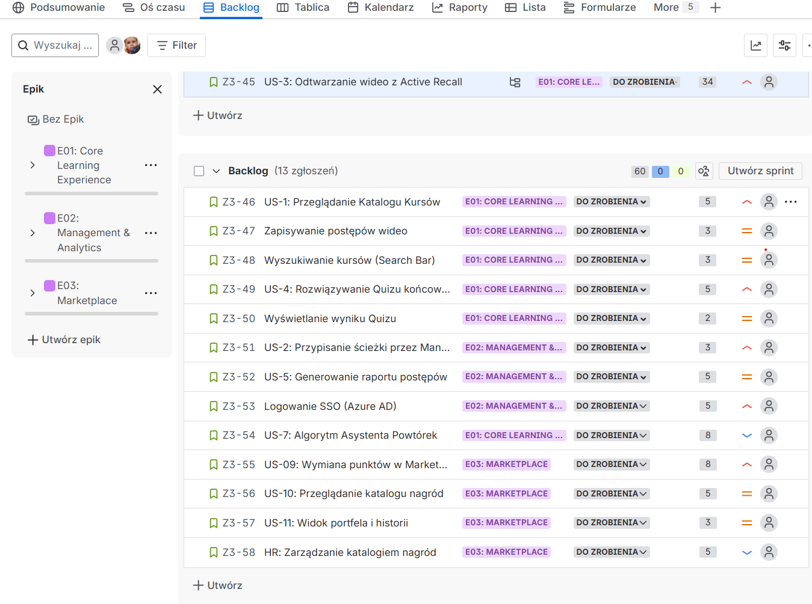
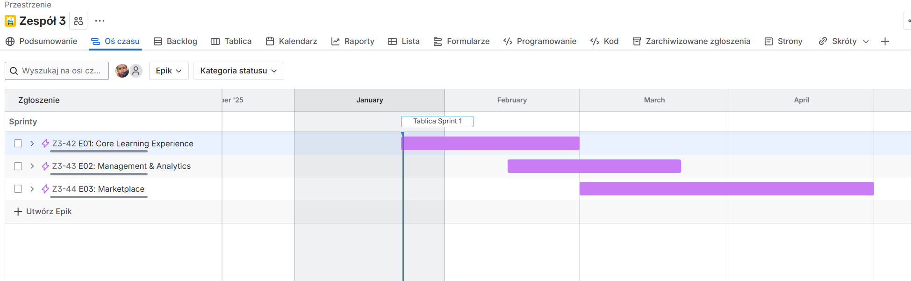
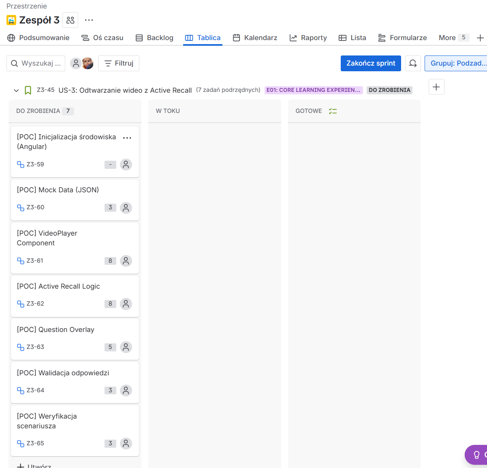

# Sprawozdanie - Zadanie 3: Planowanie Projektu i Symulacja Sprintu
  Maciej Zeliaś
  Patryk Baranek
  Radosław Grędel
  Tomasz Kajda

**Link do projektu Jira:** [Jira3](https://zpi-cy-1.atlassian.net/jira/software/projects/Z3/boards/35?atlOrigin=eyJpIjoiMGZiZDM3YzFjMjYyNGUzMzhjZDNhYzQ3MjBhMjE3N2MiLCJwIjoiaiJ9)

---
## Część A: Backlog Produktów i Roadmapa

### 1. Product Backlog (MVP)
Poniższy zrzut ekranu przedstawia Backlog Produktu w Jira. Zadania zostały podzielone na Epiki ("Core Learning Experience", "Management & Analytics", "Marketplace"), a kluczowe historyjki użytkownika zostały wyestymowane przy użyciu Story Points.

### 2. Roadmapa (Oś czasu)
Wizualizacja planu na osi czasu (Gantt) obejmująca planowany okres realizacji MVP (ok. 3 miesiące).

---

## Część B: Planowanie Sprintu 1

### 1. Cel Sprintu
> **Cel Sprintu:** Zweryfikowanie technicznej wykonalności interaktywnego mechanizmu Active Recall (pauzowanie wideo i wyświetlanie pytań) poprzez stworzenie działającego prototypu (PoC).

Cel spełnia kryteria SMART: jest konkretny (mechanizm Active Recall), mierzalny (działający prototyp), osiągalny (zakres ograniczony do jednej funkcjonalności), istotny (kluczowa wartość systemu) i określony w czasie (2 tygodnie).

### 2. Proof of Concept (PoC): Active Recall
W ramach pierwszego sprintu realizujemy zadanie badawcze (Spike) dla historyjki **"US-3: Odtwarzanie wideo z Active Recall"**.

**Hipoteza:**
Implementacja interaktywnych pytań nakładanych bezpośrednio na odtwarzacz wideo (HTML5 + Angular) jest możliwa do zrealizowania bez znaczącego wpływu na płynność odtwarzania i nie wymaga korzystania z płatnych, zewnętrznych platform streamingowych.

**Eksperyment i zakres PoC:**
Zbudowanie minimalnej aplikacji Angular (Standalone), która:
1.  Odtwarza lokalny plik wideo.
2.  Pobiera listę znaczników czasowych i pytań z pliku `video-data.json` (Mock Data).
3.  Zatrzymuje odtwarzanie w momencie nadejścia markera.
4.  Wyświetla modal z pytaniem (Overlay) i blokuje możliwość wznowienia filmu do momentu wybrania odpowiedzi.

**Kryteria sukcesu:**
*   Opóźnienie zatrzymania wideo względem znacznika < 0.5 sekundy.
*   Pytanie wyświetla się poprawnie na warstwie nad wideo.
*   Mechanizm walidacji odpowiedzi działa poprawnie (blokuje/puszcza dalej).

**Decyzje:**
Jeśli PoC zakończy się sukcesem, rozwiązanie zostanie zintegrowane z głównym repozytorium projektu w kolejnym sprincie. W przypadku porażki (np. problemy z synchronizacją na mobile), rozważymy użycie gotowego rozwiązania open-source (np. H5P), co jednak może ograniczyć elastyczność UI.

### 3. Backlog Sprintu
Zadania wybrane do realizacji w Sprincie 1, skupione wokół budowy PoC.

### 4. Definition of Done (DoD)
Kryteria, które muszą zostać spełnione dla każdego zadania w sprincie:

1.  **Kod:** Napisany zgodnie z Code Style, bez "dead code", zacommitowany na repozytorium.
2.  **Testy:** Unit testy przechodzą (dla logiki biznesowej), weryfikacja manualna potwierdza działanie.
3.  **Wymagania:** Wszystkie Kryteria Akceptacji (AC) z zadania są spełnione.
4.  **Review:** Kod został przejrzany i zatwierdzony przez inną osobę z zespołu (Pull Request).
5.  **Czystość:** Brak błędów typu Critical/Blocker w konsoli/logach.

### 5. Analiza Pre-Mortem
**Scenariusz porażki:** PoC interaktywnego wideo okazuje się nieużywalne (zbyt wolne działanie, irytujące UX) lub zbyt trudne do wdrożenia w zakładanym czasie.

**Zidentyfikowane zagrożenia:**
1.  **Techniczne:** Biblioteka wideo nie raportuje postępu czasu (timeupdate) z wystarczającą częstotliwością, przez co pytania pojawiają się za późno.
2.  **UX:** Użytkownik czuje się sfrustrowany ciągłym przerywaniem wideo ("rwanie" flow nauki).
3.  **Integracja:** Trudności z responsywnością nakładki (Overlay) na urządzeniach mobilnych.

**Plan zapobiegawczy:**
1.  **Prototypowanie:** Najpierw budujemy "brzydki" prototyp (tylko mechanizm), aby sprawdzić eventy przeglądarki przed stylowaniem.
2.  **Testy UX:** Sprawdzimy na prototypie, czy pauzowanie nie jest zbyt gwałtowne (możliwe dodanie animacji/fade-out).
3.  **Keep it Simple:** W PoC używamy sztywnych danych (JSON), nie budujemy backendu ani edytora, aby skupić się tylko na odtwarzaczu.
